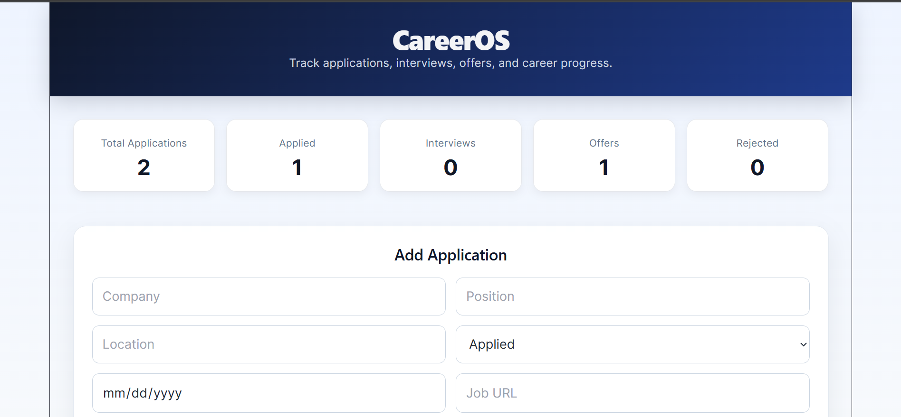
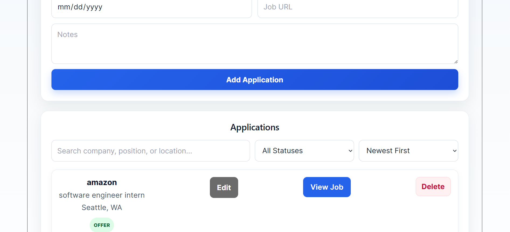

# CareerOS

CareerOS is a full-stack job application tracking web application designed to help users organize and manage their job search. Users can add applications, update their progress through the hiring process, search and filter applications, and view statistics from a simple dashboard.
## Screenshots

### Dashboard & Application Form


### Application Management


## Features

- Add and save job applications
- Edit existing applications
- Delete applications
- Track application status
    - Applied
    - Interview
    - Offer
    - Rejected
- Search applications by company, position, or location
- Filter applications by status
- Sort applications by newest, oldest, or company name
- View application statistics
- Store job URLs and notes
- Responsive user interface
- Persistent application data

## Tech Stack

### Frontend
- React
- JavaScript
- Vite
- HTML
- CSS

### Backend
- Java
- Spring Boot
- Spring Web
- Maven
- REST API

## Architecture

CareerOS uses a full-stack client-server architecture.

The React frontend handles the user interface and communicates with the Spring Boot backend through HTTP requests.

The backend exposes REST API endpoints that handle application data and CRUD operations.

```text
React Frontend
      |
      | HTTP / JSON
      v
Spring Boot REST API
      |
      v
Application Data
```

## CRUD Functionality

CareerOS supports the four primary CRUD operations:

- **Create** — Add a new job application
- **Read** — Retrieve and display saved applications
- **Update** — Edit application information and status
- **Delete** — Remove an application

## Project Structure

```text
career-os-backend/
├── career-os-frontend/     # React frontend
│   ├── src/
│   ├── public/
│   └── package.json
├── src/                    # Spring Boot backend
│   ├── main/
│   │   ├── java/
│   │   └── resources/
│   └── test/
├── data/
├── pom.xml
└── README.md
```

## Running the Project

### Backend

Make sure Java is installed.

From the main project directory, run:

```bash
./mvnw spring-boot:run
```

On Windows, you can use:

```bash
mvnw.cmd spring-boot:run
```

The backend runs locally on:

```text
http://localhost:8080
```

### Frontend

Open another terminal and navigate to:

```bash
cd career-os-frontend
```

Install dependencies:

```bash
npm install
```

Start the development server:

```bash
npm run dev
```

The frontend will typically be available at:

```text
http://localhost:5173
```

## API

The frontend communicates with the Spring Boot REST API using the applications endpoint:

```text
/api/applications
```

The application uses HTTP methods including:

```text
GET
POST
PUT
DELETE
```

## What I Learned

Building CareerOS gave me hands-on experience developing and connecting both sides of a full-stack application. Through this project, I practiced:

- Building REST APIs with Spring Boot
- Creating interactive interfaces with React
- Connecting a React frontend to a Java backend
- Sending and receiving JSON data
- Implementing CRUD operations
- Managing application state with React hooks
- Handling HTTP requests
- Organizing backend code using controllers, services, repositories, and models
- Debugging frontend and backend integration issues
- Using Git and GitHub for version control

## Future Improvements

Potential future versions of CareerOS could include:

- User authentication
- Individual user accounts
- Database integration for production deployment
- Application deadlines and reminders
- Interview scheduling
- Resume tracking
- Data visualization and analytics
- Cloud deployment

## Author

Mohamed Mustafa

Computer Science / Software Engineering Student